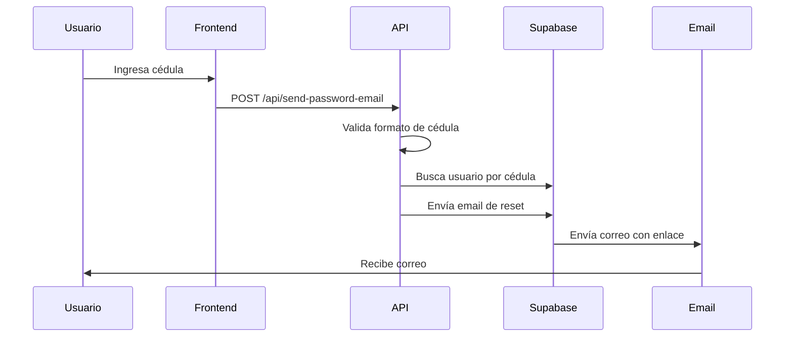

# Sistema de Restablecimiento de Contraseñas - ORPA

## Descripción General

Este documento describe el sistema de restablecimiento de contraseñas implementado en la aplicación ORPA, incluyendo las mejoras de seguridad y manejo de errores.

## Arquitectura del Sistema

### Componentes Principales

1. **API Endpoint**: `/api/send-password-email`
2. **Página de Reset**: `/auth/reset-password`
3. **Configuración de Entorno**: Variables en `.env.production` y `.env.local`

## Flujo de Funcionamiento

### 1. Solicitud de Restablecimiento



### 2. Validaciones Implementadas

#### Validación de Cédula
```typescript
const cedulaRegex = /^[0-9]{8,10}$/;
```
- Debe contener solo números
- Longitud entre 8 y 10 dígitos

#### Validación de Email
```typescript
const emailRegex = /^[^\s@]+@[^\s@]+\.[^\s@]+$/;
```
- Formato estándar de email
- No permite espacios

#### Validación de Token
- Verifica presencia de `type=recovery`
- Valida tiempo de expiración
- Maneja tokens malformados

## Variables de Entorno

### Producción (`.env.production`)
```env
NEXT_PUBLIC_SITE_URL=https://tudominio.com
NEXT_PUBLIC_RESET_PASSWORD_EXPIRY=3600
NEXT_PUBLIC_SUPPORT_EMAIL=soporte@tudominio.com
NEXT_PUBLIC_SUPABASE_URL=https://xxx.supabase.co
NEXT_PUBLIC_SUPABASE_ANON_KEY=xxx
SUPABASE_SERVICE_ROLE_KEY=xxx
```

### Desarrollo (`.env.local`)
```env
NEXT_PUBLIC_SITE_URL=http://localhost:3000
# ... otras variables
```

## Mejoras de Seguridad

### Headers de Seguridad
Configurados en `next.config.ts`:
- `X-Content-Type-Options: nosniff`
- `X-Frame-Options: DENY`
- `X-XSS-Protection: 1; mode=block`
- `Referrer-Policy: strict-origin-when-cross-origin`

### Logging y Monitoreo

#### Logs de Solicitud
```typescript
console.log('Reset password request:', {
  cedula: cedulaString,
  email: correo,
  siteUrl,
  usingServiceKey: isServiceKeyConfigured,
  timestamp: new Date().toISOString()
});
```

#### Logs de Error
```typescript
console.error('Reset password error:', {
  error: resetError,
  email: correo,
  cedula: cedulaString,
  siteUrl,
  timestamp: new Date().toISOString()
});
```

## Manejo de Errores

### Tipos de Error

1. **Token Expirado**
   - Mensaje: "El enlace de recuperación ha expirado"
   - Acción: Botón "Solicitar nuevo enlace"

2. **Token Inválido**
   - Mensaje: "Enlace de recuperación inválido"
   - Acción: Botón "Solicitar nuevo enlace"

3. **Cédula Inválida**
   - Mensaje: "Formato de cédula inválido"
   - Código: 400

4. **Email No Encontrado**
   - Mensaje: "El correo no está registrado"
   - Código: 404

### Componente de Error Mejorado

```typescript
const ErrorMessage = ({ error, onRetry }) => (
  <div className="mb-6 bg-red-50 border-l-4 border-red-500 p-4 rounded-lg">
    <div className="flex items-start justify-between">
      <div className="flex items-start">
        {/* Icono de error */}
        <div>
          <h3 className="text-sm font-medium text-red-800">Error</h3>
          <p className="text-sm text-red-700 mt-1">{error}</p>
        </div>
      </div>
      {(error.includes("expirado") || error.includes("inválido")) && (
        <Link href="/auth/forgot-password">
          Solicitar nuevo enlace
        </Link>
      )}
    </div>
  </div>
);
```

## Testing

### Tests Implementados

Archivo: `__tests__/reset-password.test.ts`

1. **Detección de tokens expirados**
2. **Validación de tokens válidos**
3. **Validación de formato de email**
4. **Validación de formato de cédula**
5. **Manejo de enlaces sin tipo recovery**
6. **Manejo de hash vacío**

### Ejecutar Tests

```bash
npm test reset-password
```

## Configuración de Producción

### Pasos para Deployment

1. **Actualizar Variables de Entorno**
   ```bash
   # Actualizar NEXT_PUBLIC_SITE_URL con el dominio real
   NEXT_PUBLIC_SITE_URL=https://tudominio.com
   ```

2. **Verificar Service Role Key**
   - Obtener desde Supabase Dashboard
   - Configurar en variables de entorno del hosting

3. **Configurar DNS y SSL**
   - Asegurar que el dominio apunte al servidor
   - Configurar certificado SSL

4. **Testing en Producción**
   - Probar flujo completo de reset
   - Verificar recepción de emails
   - Validar redirecciones

## Troubleshooting

### Problemas Comunes

1. **Enlaces apuntan a localhost**
   - Verificar `NEXT_PUBLIC_SITE_URL` en producción
   - Revisar configuración de hosting

2. **Emails no se envían**
   - Verificar `SUPABASE_SERVICE_ROLE_KEY`
   - Revisar configuración de email en Supabase

3. **Tokens expiran muy rápido**
   - Ajustar `NEXT_PUBLIC_RESET_PASSWORD_EXPIRY`
   - Verificar configuración en Supabase

### Logs de Debugging

Para habilitar logs detallados:

```typescript
// En desarrollo
console.log('Reset token validation:', {
  hasRecoveryType: hash.includes("type=recovery"),
  expiresAt: expiresAt ? new Date(parseInt(expiresAt) * 1000).toISOString() : 'No expiry',
  isExpired: expiresAt ? new Date(parseInt(expiresAt) * 1000) < new Date() : false,
  timestamp: new Date().toISOString()
});
```

## Contacto y Soporte

Para problemas técnicos o consultas:
- Email: soporte@tudominio.com
- Documentación: Este archivo
- Tests: `__tests__/reset-password.test.ts`